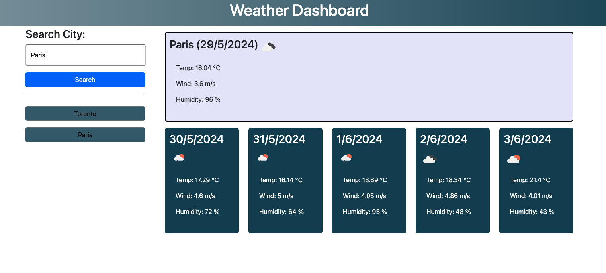

# Weather-Dashboard

## Description
This Bootcamp challenge assignment required the use of server-side APIs for this Weather Dashboard.
Specifically the use of OpenWeatherMap: https://openweathermap.org/.
This dashboard needed to be able to search a city and show the current weather conditions as well as a 5-day forecast, it had to show past searched cities and the ability to be clicked on and show the current weather again, which showed the temperature, humidity and wind speed.

## Screenshots

## Links
Github: https://github.com/S1NGS1NG80/Weather-Dashboard.git
Deployed: 